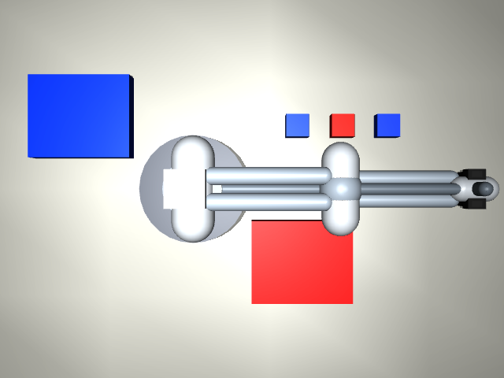

# Telepix Robotics - MuJoCo Robot Sorting

MuJoCo 기반 로봇 팔이 RGB-D 카메라로 작업물을 인식하고, 외부 FastAPI 검사 모듈의 색상 분류 및 불량 판정 결과를 받아 정상품 bin과 불량품 bin으로 분류하는 시뮬레이션입니다. Python 실행은 `uv`를 기준으로 구성되어 있으며, Docker Compose에서는 `inspection-api`와 `sim` 컨테이너가 같은 bridge network에서 HTTP로 통신합니다.

## 선택한 로봇 모델

현재 사용한 로봇은 UR5, Franka Panda 같은 상용 로봇 asset이 아니라 프로젝트 내부에서 생성하는 custom educational MuJoCo MJCF robot arm입니다.

구현 위치:

- `mujoco-robot-sorting/src/robot_sorting/simulation/scene_builder.py`
- `mujoco-robot-sorting/src/robot_sorting/robot/kinematics.py`
- `mujoco-robot-sorting/src/robot_sorting/robot/controller.py`

왜 이 로봇을 사용했는가:

- 외부 mesh, 라이선스, asset 다운로드 없이 Docker와 CI에서 재현 가능하게 실행하기 위해서입니다.
- base yaw, shoulder, elbow 3-DOF 구조라 분석적 IK를 설명하고 테스트하기 쉽습니다.
- 본 과제의 핵심인 외부 검사 모듈, RGB-D perception, grasp planning, collision-aware trajectory, bin placement를 안정적으로 검증하기에 충분합니다.
- 복잡한 상용 로봇 모델을 붙이면 시각적으로는 더 현실적이지만, 초기 과제 검증에서는 asset 경로, mesh 렌더링, 관절 제한, controller 튜닝 때문에 재현성이 흔들릴 수 있습니다.

한계도 명확합니다. 이 모델은 실제 산업용 로봇의 동역학을 검증한 모델이 아니며, end-effector도 물리적인 force-closure gripper가 아니라 suction-style logical attachment로 pick-and-place를 재현합니다. viewer에서는 two-finger gripper geometry가 보이지만, 물체 부착은 `MujocoSortingEnv._update_attached_object`에서 논리적으로 처리됩니다.

## 작업 시나리오 구현 코드

현장형 deterministic scenario catalog는 다음 파일에 구현되어 있습니다.

- `mujoco-robot-sorting/src/robot_sorting/scenarios.py`
- `mujoco-robot-sorting/src/robot_sorting/cli.py`
- `mujoco-robot-sorting/src/robot_sorting/simulation/scene_builder.py`
- `mujoco-robot-sorting/tests/unit/test_scenario_catalog.py`
- `mujoco-robot-sorting/tests/integration/test_scenario_runner.py`

시나리오 정의는 작업물 label, spawn position, bin position override를 포함합니다. CLI는 `--scenario` 값을 받아 같은 scene configuration으로 headless run, 전체 scenario 검증, MuJoCo viewer playback을 실행합니다.

현재 시나리오:

| Scenario ID | 현장 상황 | 검증 목표 |
| --- | --- | --- |
| `balanced_conveyor_batch` | 정상품과 불량품이 균형 있게 들어오는 일반 생산 배치 | 기본 분류와 양쪽 bin 적재 |
| `high_defect_rework_batch` | 공정 이상 후 불량 비율이 높은 재작업 배치 | defect bin 집중 적재 |
| `normal_heavy_end_of_shift` | 교대 마감 시 정상품이 대부분인 안정 배치 | normal bin 다중 적재 |
| `crowded_pick_zone_batch` | pick zone에 작업물이 촘촘히 배치된 배치 | 근접 물체 인식과 non-overlap placement |
| `bin_changeover_shift` | 작업 중 bin 위치가 변경된 상황 | vision 기반 dynamic bin detection |
| `small_batch_single_defect` | 샘플 검사처럼 소량 중 단일 불량만 분리 | 작은 배치에서 정상/불량 동시 처리 |

모든 시나리오는 `placed_count == total_objects`이고 `failed_count == 0`이어야 통과합니다.

## 실행 방법

```powershell
cd C:\Users\SAMSUNG\Desktop\telepix\Telepix_Robotics\mujoco-robot-sorting
uv sync --dev
uv run robot-sort list-scenarios
```

단일 시나리오 headless 실행:

```powershell
uv run robot-sort run --headless --scenario balanced_conveyor_batch --output outputs/scenarios/balanced_conveyor_batch
```

전체 시나리오 검증:

```powershell
uv run robot-sort run-scenarios --output outputs/scenario-check --no-save-images
```

정적 scene만 확인:

```powershell
uv run robot-sort view --scenario balanced_conveyor_batch --static
```

MuJoCo viewer에서 로봇 팔 움직임을 보려면 viewer의 Run 버튼만 누르는 방식이 아니라 아래 CLI playback 명령을 사용해야 합니다. 이 명령이 sorting command를 만들고 passive viewer를 열어 controller step을 직접 재생합니다.

## 시나리오별 Viewer 명령

```powershell
uv run robot-sort view --scenario balanced_conveyor_batch --animate --delay 0.03
uv run robot-sort view --scenario high_defect_rework_batch --animate --delay 0.03
uv run robot-sort view --scenario normal_heavy_end_of_shift --animate --delay 0.03
uv run robot-sort view --scenario crowded_pick_zone_batch --animate --delay 0.03
uv run robot-sort view --scenario bin_changeover_shift --animate --delay 0.03
uv run robot-sort view --scenario small_batch_single_defect --animate --delay 0.03
```

움직임을 더 천천히 보려면 `--delay 0.05` 또는 `--delay 0.1`로 늘립니다. viewer 창은 playback이 끝난 뒤에도 열린 상태로 유지되며, 창을 닫으면 CLI가 종료됩니다.

## 결과 스크린샷

README용 검증 산출물은 `small_batch_single_defect`로 생성했습니다.

실행 명령:

```powershell
uv run robot-sort run --headless --scenario small_batch_single_defect --output docs/assets/readme-small-batch
```

결과:

- Screenshot: `mujoco-robot-sorting/docs/assets/readme-small-batch/camera_rgb.png`
- Fallback RGB screenshot: `mujoco-robot-sorting/docs/assets/readme-small-batch/camera_rgb_fallback.png`
- Summary: `mujoco-robot-sorting/docs/assets/readme-small-batch/summary.json`
- Result log: `mujoco-robot-sorting/docs/assets/readme-small-batch/result_log.csv`



현재 README 검증 run의 요약은 다음과 같습니다.

```json
{
  "total_objects": 3,
  "placed_count": 3,
  "failed_count": 0,
  "success_rate": 1.0,
  "rgbd_used": true,
  "depth_fallback_used": true,
  "trajectory_collision_failures": 0,
  "table_penetration_failures": 0
}
```

## 프로그램 구조

```text
mujoco-robot-sorting/
  src/robot_sorting/
    api.py                         FastAPI external inspection API
    cli.py                         uv/typer command line entrypoints
    config.py                      simulation config factory
    scenarios.py                   deterministic production scenario catalog
    schemas.py                     shared Pydantic data contracts
    modules/
      vision_module.py             RGB color detection
      inspection_module.py         normal/defect inspection logic
      inspection_client.py         HTTP client for FastAPI inspection API
      task_planner.py              pick/place task generation
      command_queue.py             robot command queue and latency tracking
      result_logger.py             CSV/JSON output writer
    perception/
      camera_calibration.py        top-down camera calibration
      depth_processor.py           RGB-D to point cloud helpers
      pose_estimator.py            3D object pose estimation
      grasp_pose_generator.py      top-down grasp pose generation
    planning/
      trajectory_planner.py        waypoint trajectory and collision checks
      bin_placement_planner.py     non-overlapping in-bin placement
    robot/
      kinematics.py                analytical IK for custom 3-DOF arm
      safety.py                    workspace and table clearance checks
      controller.py                command execution in MuJoCo
    simulation/
      scene_builder.py             MJCF scene generation
      mujoco_env.py                MuJoCo environment wrapper
      renderer.py                  RGB-D rendering and fallback rendering
  tests/
    unit/
    integration/
    api/
    latency/
```

## End-Effector 동작 방식

작업 절차에서 end-effector는 다음 순서로 움직입니다.

1. 물체 위 approach pose로 이동합니다.
2. top-down grasp pose로 내려갑니다.
3. 물체를 logical attachment 상태로 전환합니다.
4. vertical escape height까지 들어 올립니다.
5. trajectory planner가 만든 collision-aware waypoint를 따라 target bin 위로 이동합니다.
6. bin 내부 non-overlapping slot에 내려놓고 attachment를 해제합니다.

현재 gripper는 실제 접촉력으로 물체를 집는 방식이 아닙니다. MuJoCo viewer에는 gripper geometry가 표시되지만, 과제 검증에서는 pick-and-place command, trajectory safety, bin placement, result logging의 설명 가능성과 재현성을 우선했습니다.

## 작업 수행 절차

```text
MuJoCo scene 생성
  -> RGB-D frame 렌더링
  -> FastAPI /inspect-rgbd 또는 local fallback 검사
  -> object pose 및 grasp pose 생성
  -> detected bin 기준 target slot 계획
  -> pick-and-place task 생성
  -> collision/table-clearance aware trajectory 생성
  -> robot command queue 적재
  -> controller 실행
  -> CSV/JSON 결과 저장
```

## 외부 모듈 선택 이유

색상 분류 및 불량품 검사를 FastAPI 외부 모듈로 분리한 이유는 다음과 같습니다.

- 로봇 제어 코드와 검사 모델을 독립적으로 교체할 수 있습니다.
- Docker Compose에서 실제 서비스 간 HTTP 통신 구조를 검증할 수 있습니다.
- `/inspect-image`, `/inspect-rgbd`, `/inspect-detections` API contract로 입력과 출력을 설명 가능하게 고정할 수 있습니다.
- 나중에 OpenCV thresholding 대신 ML 모델이나 실제 카메라 inference service로 바꾸기 쉽습니다.

## 외부 모듈 동작 방식

FastAPI 모듈은 RGB 또는 RGB-D 입력을 받아 색상 기반으로 작업물과 bin을 찾습니다.

- 파란 작업물: `normal`
- 빨간 작업물: `defect`
- 파란 bin: `normal_bin`
- 빨간 bin: `defect_bin`

RGB-D 요청에서는 depth와 camera calibration을 함께 받아 3D pose와 top-down grasp pose를 생성합니다. depth rendering이 현재 실행 환경에서 불안정하면 deterministic ground-truth RGB-D fallback을 사용하고, 이 사실은 `summary.json`의 `depth_fallback_used`에 기록됩니다.

## 시뮬레이션 연동 인터페이스

Docker Compose 서비스:

```text
inspection-api  FastAPI inspection service, port 8000
sim             MuJoCo sorting pipeline, INSPECTION_API_URL=http://inspection-api:8000
test            pytest runner
lint            ruff runner
typecheck       mypy runner
```

두 컨테이너는 `robot-sorting-net` bridge network에 연결됩니다.

로컬 API 실행:

```powershell
uv run uvicorn robot_sorting.api:app --host 0.0.0.0 --port 8000
uv run robot-sort run --headless --scenario balanced_conveyor_batch --inspection-api-url http://localhost:8000 --output outputs/api-balanced
```

Docker 실행:

```powershell
docker compose config
docker compose build
docker compose run --rm test
docker compose run --rm sim
```

## 시뮬레이션 결과

현재 기준으로 검증하는 성공 조건은 다음과 같습니다.

- 모든 scenario가 실패 없이 완료됩니다.
- 모든 작업물이 target bin으로 배치됩니다.
- trajectory collision failure가 0입니다.
- table penetration failure가 0입니다.
- command latency가 0.5초 SLA 안에 들어옵니다.

README용 `small_batch_single_defect` 실행 결과는 3개 중 3개 배치 성공, 실패 0건, trajectory collision failure 0건, table penetration failure 0건입니다.

최근 전체 scenario runner 결과:

| Scenario ID | Result |
| --- | --- |
| `balanced_conveyor_batch` | placed 6/6, failed 0 |
| `high_defect_rework_batch` | placed 6/6, failed 0 |
| `normal_heavy_end_of_shift` | placed 6/6, failed 0 |
| `crowded_pick_zone_batch` | placed 5/5, failed 0 |
| `bin_changeover_shift` | placed 5/5, failed 0 |
| `small_batch_single_defect` | placed 3/3, failed 0 |

전체 시나리오 검증은 아래 명령으로 재현할 수 있습니다.

```powershell
uv run robot-sort run-scenarios --output outputs/scenario-check --no-save-images
```

## 한계 분석

- 로봇 모델은 custom simplified MJCF arm입니다. 실제 산업용 로봇의 정확한 link mass, inertia, actuator, joint friction을 반영하지 않습니다.
- end-effector는 물리 접촉 기반 gripper가 아니라 logical attachment입니다.
- vision은 explainable OpenCV color thresholding입니다. 조명 변화, 반사, occlusion이 큰 실제 카메라 환경에서는 별도 보정이나 ML detector가 필요합니다.
- RGB-D depth rendering은 OpenGL/OSMesa 환경 영향을 받을 수 있어 fallback path를 제공합니다.
- conveyor belt와 dashboard 요구사항은 아직 완전한 UI/dashboard 제품으로 구현되지 않았습니다. 현재는 생산 시나리오 catalog와 CLI 결과 로그 중심입니다.
- dashboard는 현재 미구현 상태입니다. 아직 `src/robot_sorting/dashboard` 패키지, `robot-sort dashboard` CLI, 웹 대시보드 화면, Docker dashboard 서비스가 없습니다.
